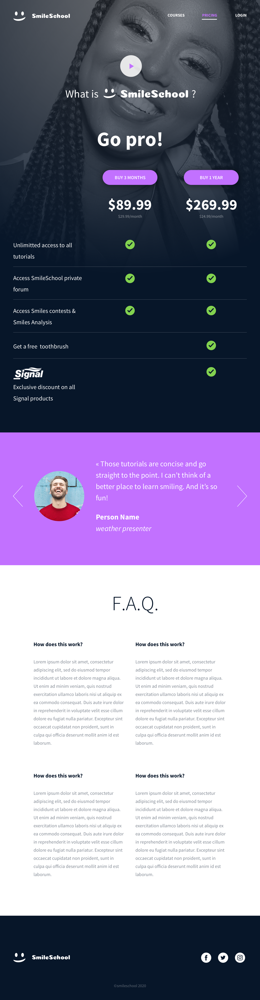

# Build a web app in JavaScript

In this project, we will finalize the previous project [0x0B. Implement a design with bootstrap](https://github.com/Cirine92/holberton-smiling-school) and make some parts dynamic with Javascript (JQuery exactly).

